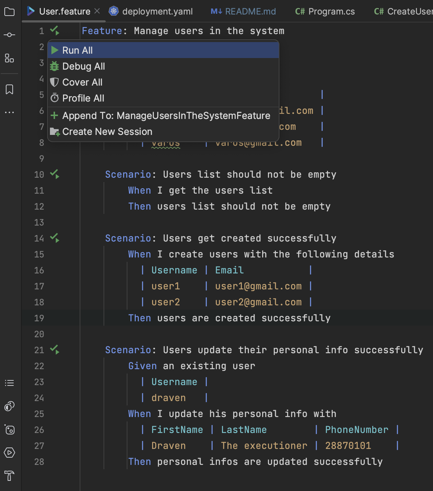

# User segmentation with Behavior Driven Development testing

User segmentation is to differentiate how the system treat users based on
parameters associated to their segments.

This project is based on [clean architecture template](https://github.com/ardalis/CleanArchitecture)  by
<a href="https://twitter.com/intent/follow?screen_name=ardalis">Ardalis
</a>

## Acceptance tests

You can find acceptance tests project under tests folder. They are written
in English using Gherkin language and run by Specflow runner.

When tests are run, an instance of the application will spin up configured with sql-lite database and
the migrations will be automatically executed. You can find the configuration code
in **ApplicationFactory** class.

### How to run ?

First install [Specflow plugin](https://docs.specflow.org/projects/getting-started/en/latest/) in your favorite IDE (They support both Visual studio
and Rider)

Build acceptance tests project and then go the feature you want to run and
hit the run button just like this

or simply go to test explorer and run all tests.
